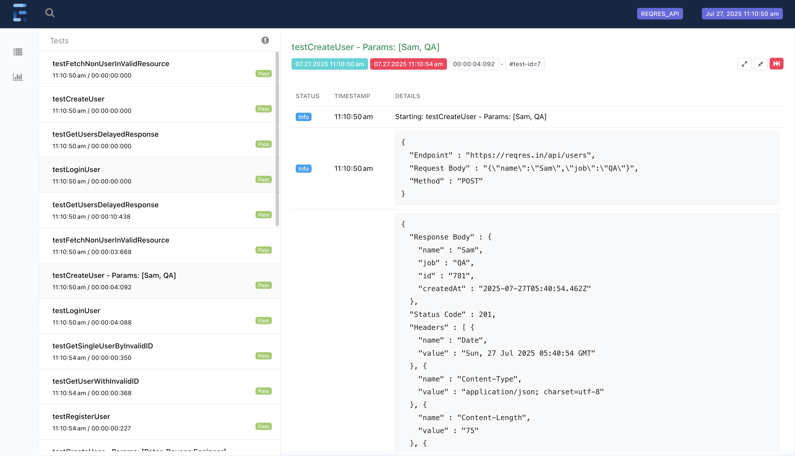

# API Automation Framework – Rest Assured + TestNG

This is a scalable API automation framework built with Java, Rest Assured, and TestNG.  
It includes reporting, logging, data-driven testing, and CI/CD integration.

---

## 📌 Features
✅ Modular design with reusable utilities  
✅ TestNG based with `@DataProvider` for data-driven testing  
✅ Centralized Routes management  
✅ Custom Logging with Request/Response filters  
✅ Extent Reports and Allure integrated  
✅ Retry logic for flaky tests  
✅ Jenkins pipeline ready (Jenkinsfile included)  
✅ Example tests: Auth, User CRUD, Negative, Performance  
✅ WireMock for mocking external services

---

## 📂 Project Structure
```
src
├── main
│ ├── java
│ │ ├── Core # BaseTest and setup
│ │ ├── Enum # StatusCode
│ │ ├── Pojo # Request/response POJOs
│ │ └── Utils # Routes, Logging, Report Manager, etc.
│ └── resources # Config and data
└── test
├── java
│ ├── AuthTests.java
│ ├── UserTests.java
│ ├── NegativeTests.java
│ ├── PerformanceTests.java
│ └── MockTests (WireMock)
└── resources
└── allure.properties
```
---

## How to Run
1. Clone this repo:

```bash
git clone <https://github.com/Niraj98-QA/Reqres_Api_Automation.git>
```

## Run tests with Maven:

```bash
mvn clean test
```

## View Allure Report:

```bash
allure serve allure-results
```
## 📊 Sample Reports

### ✅ Allure Report Overview


---

### ✅ Allure Report Suites


---

### ✅ Allure Report Graph


---

### ✅ Extent Report Suites


---

### ✅ Extent Report Graph


---

## Tech Stack
```
Language: Java

Build Tool: Maven

Test Runner: TestNG

Frameworks: Rest Assured

Reports: Allure, Extent

CI/CD: Jenkinsfile included

```
